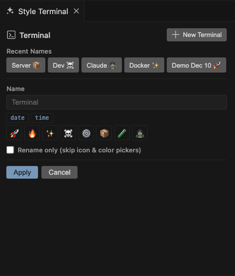

# Terminal Styler

> **[Install for VS Code](https://marketplace.visualstudio.com/items?itemName=PaperDiamond.terminal-styler)** | **[Install for Cursor](https://open-vsx.org/extension/PaperDiamond/terminal-styler)**

**If you're like me and you're running lots of terminals in Cursor and VS Code, this is for you.**

Too many times I'll have Docker, Next.js, and 5 instances of Claude running at the same time and get completely lost in the sauce. I've found that renaming terminals, setting icons, and picking colors is far too many clicks and way too annoying.

Hence, **Terminal Styler** was born.

Use a keybinding to open a style panel where you can easily edit your terminal name, color, icon, and add things like emojis, branch names, timestamps, and more. You can also create new terminals and style them VERY quickly from within the panel.

---

## What It Does

| Before                         | After                                                 |
| ------------------------------ | ----------------------------------------------------- |
| `bash`, `bash`, `bash`, `bash` | `🚀 API Server`, `🐛 Debug`, `📦 Docker`, `✨ Claude` |

- **One panel** to rename, set icon, and set color
- **Template buttons** to quickly insert folder name, git branch, date, time
- **Emoji row** for quick visual markers
- **Recent names** for styles you use often
- **New Terminal button** to create and style multiple terminals without leaving the panel

---

## Quick Start

1. Open a terminal
2. Press `Cmd+Shift+T` (Mac) or `Ctrl+Shift+T` (Windows/Linux)
3. Type a name, click some template buttons, add an emoji
4. Hit `Enter`
5. Pick an icon, pick a color, done!

Or click the **paintcan icon** in the status bar.

---

## Features

### Template Buttons

One click to insert:

- `folder` - Parent folder name
- `path` - Abbreviated path
- `repo` - Git repo name
- `branch` - Current branch
- `date` - Today's date
- `time` - Current time

### Emoji Row

Quick access to: 🚀 🔥 ✨ ☠️ ⚙️ 📦 🧪 🧟

### Keyboard Shortcuts

| Action     | Mac           | Windows/Linux  |
| ---------- | ------------- | -------------- |
| Open Panel | `Cmd+Shift+T` | `Ctrl+Shift+T` |
| Apply      | `Enter`       | `Enter`        |
| Cancel     | `Escape`      | `Escape`       |

### Options

- **Rename only** - Skip icon & color pickers when you just need a quick rename

---

## Installation

### VS Code / Cursor Marketplace

1. Open Extensions (`Cmd+Shift+X`)
2. Search "Terminal Styler"
3. Install

### Manual Install

1. Download `.vsix` from [Releases](https://github.com/paperdiamond/terminal-styler/releases)
2. Run `Extensions: Install from VSIX...` from Command Palette

---

## Requirements

- VS Code or Cursor 1.80.0+
- Git extension (optional, for branch/repo buttons)

---

## Why I Built This

I was tired of right-clicking terminals, navigating menus, and losing track of which terminal was which. Now I just hit `Cmd+Shift+T`, type `🚀 server`, and I'm done.

If this saves you even a few seconds of confusion per day, it's worth it.

---

## Contributing

Found a bug? Have an idea? [Open an issue](https://github.com/paperdiamond/terminal-styler/issues) or submit a PR.

---

## License

MIT - do whatever you want with it.

---

Made with ☕ and frustration by **Paper Diamond**

